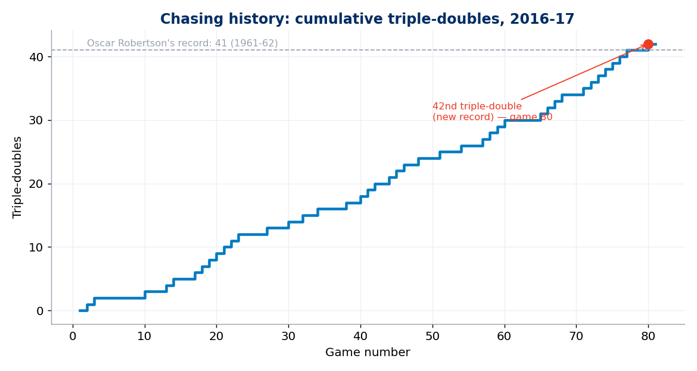
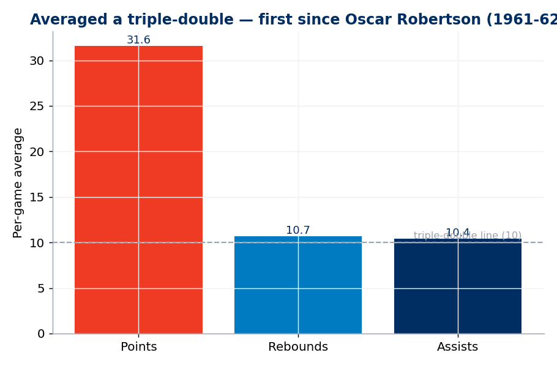
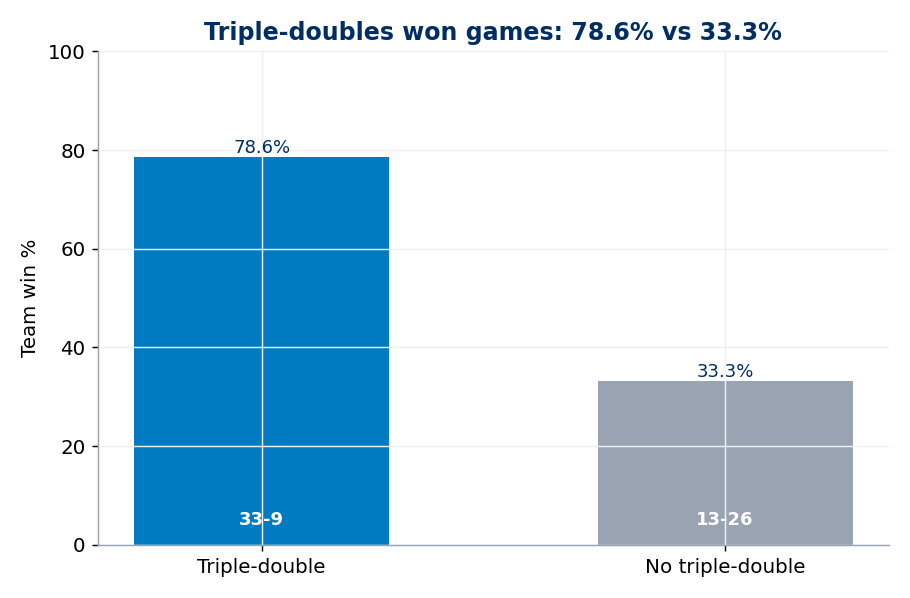
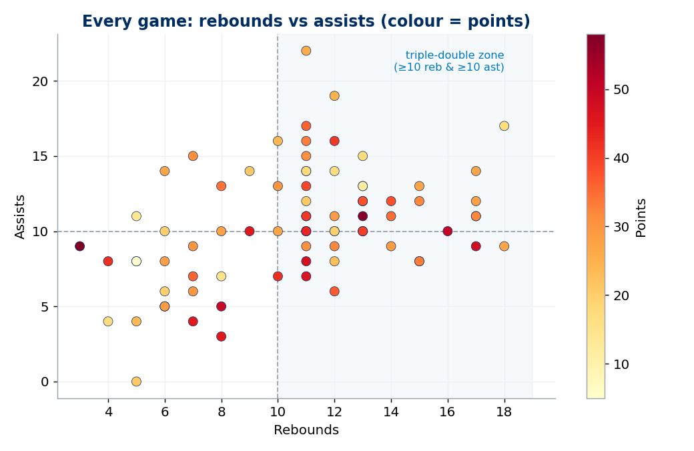
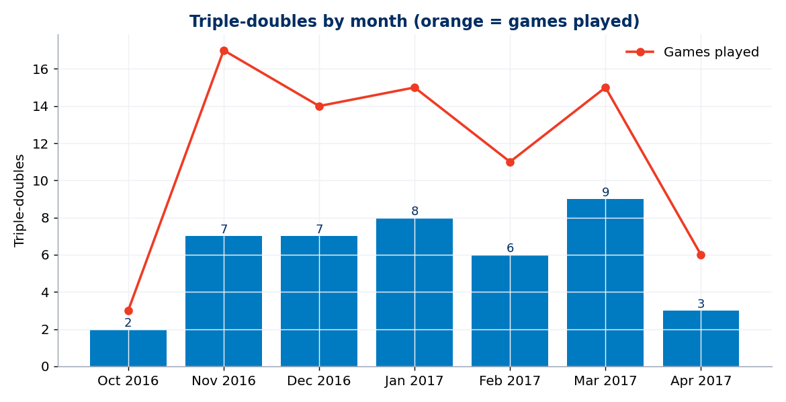
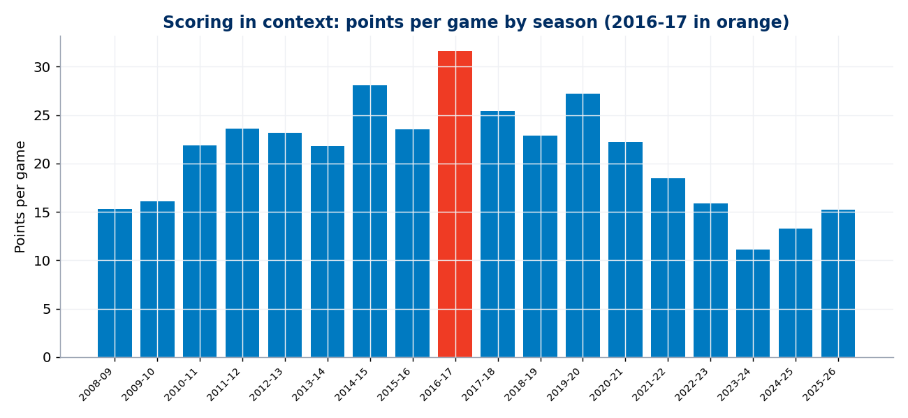

# Russell Westbrook — The Triple-Double King (2016-17 MVP season) 🏀👑

A basketball-analytics deep dive into **Russell Westbrook's 2016-17 MVP season** — the
year he became the **first player since Oscar Robertson (1961-62) to average a
triple-double** and set the **single-season triple-double record (42)**.

> **Headline:** 31.6 PPG · 10.7 RPG · 10.4 APG across 81 games — a triple-double in
> **51.9% of games** — and the Thunder won **78.6%** of those games (vs 33.3% without).

Built with a small SQL + Python pipeline. Every number is reproducible by running one
command, and the season's famous stats are **validated against the record books**
(81 games, 42 triple-doubles, 31.6 / 10.7 / 10.4) before any chart is drawn.

> 📓 **Want the whole analysis in one scrollable page** (narrative + code + charts)? Open
> [`Westbrook-MVP-analysis.ipynb`](Westbrook-MVP-analysis.ipynb) — it renders right here on GitHub.

---

## What the data says

### 1. Chasing history — 42 triple-doubles
He passed Oscar Robertson's 55-year-old record of 41 in the season's final week.


### 2. He literally averaged a triple-double


### 3. The triple-doubles *won games*
Far from being empty stats, his triple-doubles came with a **78.6% win rate** — more than
double the team's win rate in his other games.


### 4. Every game, one dot
Rebounds vs assists for all 81 games (colour = points). The top-right quadrant is the
triple-double zone — and he lived there.


### 5. Relentless, all season


### 6. A career scoring peak


---

## How it works

```
Basketball-Reference game log  ─►  build_dataset.py  ─►  westbrook_2016_17_gamelog.csv
                                        │ (validated vs the record books)
                                        ▼
                              analyze_sql.py  (DuckDB SQL)  ─►  q_*.csv
                                        ▼
                                     viz.py  ─►  outputs/*.png
```

- **Data:** Westbrook's 2016-17 game log from
  [Basketball-Reference](https://www.basketball-reference.com/players/w/westbru01/gamelog/2017/)
  — one row per game (points, rebounds, assists, result), parsed with `pandas`.
- **SQL:** aggregations run on the local CSV via **DuckDB**.
- **Charts:** **matplotlib**, in OKC Thunder colours.

See [`SOURCES.md`](SOURCES.md) for data provenance.

## Run it yourself
```bash
pip install -r requirements.txt
python run_all.py
```
Regenerates the dataset, the SQL tables (`data/processed/`) and every chart (`outputs/`).
First run downloads + caches the data; later runs are offline.

## Project structure
```
westbrook-mvp-2016-17/
├── run_all.py            # one command runs the whole pipeline
├── src/
│   ├── common.py         # paths, config, cached HTTP getter
│   ├── build_dataset.py  # fetch + clean + validate -> game-log CSV
│   ├── analyze_sql.py    # DuckDB SQL aggregations
│   └── viz.py            # matplotlib charts
├── data/raw/             # cached download
├── data/processed/       # game-log CSV + query outputs
└── outputs/              # generated charts (PNG)
```

## Caveats
- Single regular season (2016-17); playoffs not included.
- A "triple-double" = double figures (≥10) in points, rebounds and assists in one game.

---
*Personal basketball-analytics portfolio project. Data: Basketball-Reference (free, public).*
